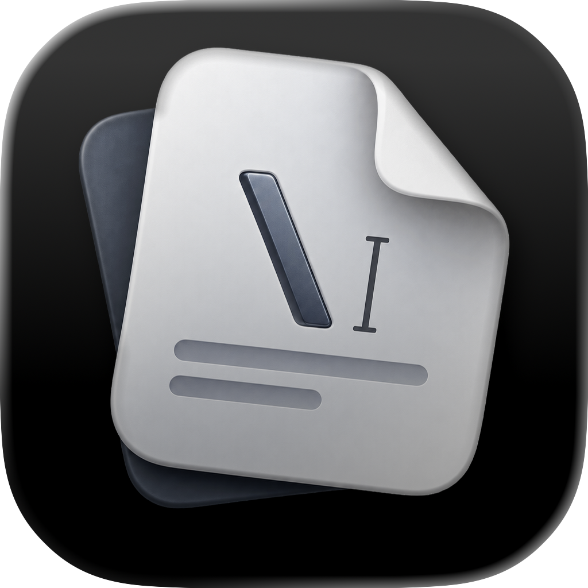

# graf

[](https://github.com/pol-cova/graf/actions/workflows/ci.yml)
[](https://github.com/pol-cova/graf/releases)
[](LICENSE)

<p align="center">
  
</p>

graf is a native macOS editor for LaTeX and Typst. It keeps source, compilation, and PDF preview in one local workspace, so you can think about what you're writing instead of the tools.

> graf is alpha software. Keep important documents under version control or backed up.

## Features

- A writing column set in a reading typeface, with markup that steps back and Focus mode for the paragraph you're writing
- Saves and compiles when you pause, with Tectonic for LaTeX and Typst for Typst, both bundled
- PDF preview with PDFKit that keeps your place across rebuilds, and keeps the last good PDF when a build fails
- Errors shown on the line that caused them
- An outline and project files in a native sidebar
- New projects from templates, and a launch screen that reopens your last project where you left off
- System spell check, dictation, and text services for prose, never for markup
- Plain local files with atomic saves

## Install

Prebuilt macOS releases are available from [GitHub Releases](https://github.com/pol-cova/graf/releases) and Homebrew:

```bash
brew install --cask pol-cova/tap/graf
```

graf requires macOS 15 or later on Apple Silicon.

## Build from source

You need Xcode 16 or later and stable Rust with the `aarch64-apple-darwin` target.

```bash
git clone https://github.com/pol-cova/graf.git
cd graf
GRAF_CONFIGURATION=debug ./scripts/build_app.sh --no-dmg
open target/debug/bundle/Graf.app
```

`./scripts/build_app.sh` without options builds the release app and a DMG. It downloads the pinned Tectonic and Typst listed in `COMPILERS.lock` into the app. Set `GRAF_SKIP_COMPILERS=1` to use the ones on your `PATH` instead.

## Repository layout

- `crates/graf-core`: the Rust core. It handles compiling, diagnostics, project files, settings, templates, crash recovery, bibliography and label indexing, outline, linting, stats, and plain-text editing logic. It has no UI dependencies.
- `crates/graf-ffi`: the bridge that exposes the core to Swift through [UniFFI](https://mozilla.github.io/uniffi-rs/).
- `apple/`: the Swift package for the app, built with SwiftUI and AppKit, TextKit 2 for the editor, and PDFKit for the preview.

## Development

```bash
cargo fmt --check
cargo check
cargo clippy --all-targets -- -D warnings
cargo test

./scripts/build_core_xcframework.sh
swift build --package-path apple
swift test --package-path apple
```

Open `apple/Package.swift` in Xcode to work on the app. Run `./scripts/build_core_xcframework.sh` again after changing the Rust core.

Read [CONTRIBUTING.md](CONTRIBUTING.md) before opening a pull request. Use [GitHub Discussions](https://github.com/pol-cova/graf/discussions) for support and follow [SECURITY.md](SECURITY.md) for private vulnerability reports.

## Acknowledgements

graf's core is written in [Rust](https://www.rust-lang.org/) and its interface in Swift.

- [Tectonic](https://tectonic-typesetting.github.io/) (MIT) compiles LaTeX. Bundled into release builds.
- [Typst](https://typst.app/) (Apache-2.0) compiles Typst. Bundled into release builds.
- [UniFFI](https://mozilla.github.io/uniffi-rs/) (MPL-2.0) generates the Swift bindings.
- [Serde](https://serde.rs/), [log](https://crates.io/crates/log), and [tempfile](https://crates.io/crates/tempfile). See [Cargo.lock](Cargo.lock) for the complete dependency list.

License texts for the bundled compilers live in [`bundle/licenses/`](bundle/licenses) and ship inside the app under `Resources/bin/LICENSES`.

## License

graf is available under the [Apache License 2.0](LICENSE).
